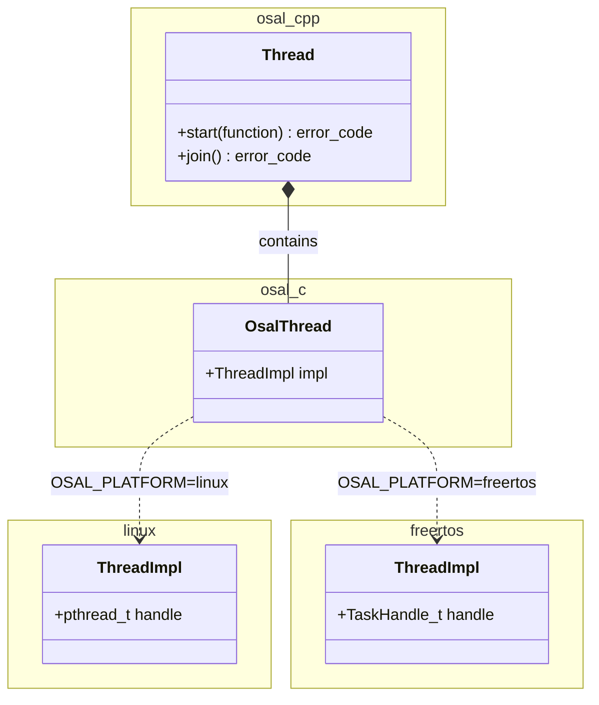

# osal

OS abstraction layer providing unified C and C++ APIs for common OS and RTOS primitives.
Architecture is organized around a portable C layer with an optional C++ wrapper for RAII and object-oriented use.

Main features:

- **dual-layer API**: thin C API (`osal::c`) for direct use, and C++ RAII wrappers (`osal::cpp`) built on top of it,
- **ISR-safe variants**: dedicated `*Isr()` operations for mutex and semaphore use from interrupt context,
- **threads**: create, join, yield, and prioritize with a 5-level priority system,
- **synchronization**: mutexes (recursive and non-recursive), semaphores, and scoped locks — all with optional timeouts,
- **time and sleep**: timestamp functions, time unit conversions, and `std::chrono`-based sleep.

## Supported Platforms

| `OSAL_PLATFORM` | Backend details                     |
| --------------- | ----------------------------------- |
| `linux`         | Linux backend using POSIX API       |
| `freertos`      | FreeRTOS backend using FreeRTOS API |

Backend selection is controlled at build time with `OSAL_PLATFORM`. The architecture is designed to accommodate
additional backends over time.

> [!IMPORTANT]
>
> `osal` requires the target project to use CMake.

## Architecture

### Components

- **`osal`** — C API layer and platform backends. Exposes primitives for:
    - threads,
    - mutexes,
    - semaphores,
    - sleep,
    - time/timestamp utilities.

- **`cpp`** — C++ wrapper layer built on top of the C API. Adds RAII and object-oriented abstractions.

The diagram below illustrates the layering. The C++ API is a thin wrapper over the C API. The C API delegates all
platform-specific work to the selected backend:



### Technologies

- **Language**: C++23, C17
- **Build System**: CMake (minimum version 3.28)
- **Package Manager**: Conan (test dependencies only)
- **Static Analysis**: clang-format, clang-tidy
- **CI/CD**: GitHub Actions

### Repository Structure

`osal` follows the standard `kubasejdak-org` repository layout for C++ libraries:

```bash
osal/
├── cmake/                              # CMake build system
│   ├── compilation-flags.cmake         # Internal compilation flags
│   ├── components.cmake                # Helper component loader (FetchContent helper)
│   ├── modules/                        # CMake Find*.cmake modules for dependencies
│   └── presets/                        # Internal preset helpers
├── lib/                                # Core components
│   ├── osal/                           # C API (osal::c) and platform backends
│   │   ├── common/                     # Platform-independent implementation (osal::common)
│   │   ├── linux/                      # Linux backend (pthread)
│   │   └── freertos/                   # FreeRTOS backend
│   └── cpp/                            # C++ wrapper API (osal::cpp)
├── tests/                              # Test suite (Catch2)
├── tools/                              # Development tools and scripts
├── .devcontainer/                      # Dev container configuration
├── .github/workflows/                  # GitHub Actions workflows
└── CMakePresets.json                   # Development CMake presets
```

## Usage

### CMake Integration

Create a `Findosal.cmake` module (typically in cmake/modules directory):

```cmake
include(FetchContent)
FetchContent_Declare(osal
    GIT_REPOSITORY  https://github.com/kubasejdak-org/osal.git
    GIT_TAG         <commit-sha|branch|tag>
)

FetchContent_MakeAvailable(osal)
include(${osal_SOURCE_DIR}/cmake/components.cmake)
```

> [!NOTE]
>
> `GIT_TAG` accepts any ref recognized by CMake FetchContent: a full commit SHA, a branch name, or a tag.

Then add the module directory to the CMake search path and request the library:

```cmake
list(APPEND CMAKE_MODULE_PATH "${CMAKE_CURRENT_SOURCE_DIR}/cmake/modules")

find_package(osal)
```

### Configuration

Control platform selection via CMake variables (typically in `CMakePresets.json`):

| Variable        | Purpose                             | Values              |
| --------------- | ----------------------------------- | ------------------- |
| `OSAL_PLATFORM` | Selects the platform backend to use | `linux`, `freertos` |

Set it in your preset or pass it directly:

```bash
cmake -DOSAL_PLATFORM=linux --preset linux-native-gcc-debug . -B out/build/linux-native-gcc-debug
```

> [!IMPORTANT]
>
> `OSAL_PLATFORM` must be defined before `osal::c` is built. The build will fail with an explicit error if it is
> missing.

### Linking

Link against `osal::cpp` for the C++ API (pulls in `osal::c` transitively) or against `osal::c` directly when C++
wrappers are not needed:

```cmake
target_link_libraries(my-app
    PRIVATE
        osal::cpp   # C++ RAII API, osal::c is linked transitively
)
```

```cmake
target_link_libraries(my-c-app
    PRIVATE
        osal::c     # C API only
)
```

### API Overview

`osal::cpp` is an optional convenience layer built on top of `osal::c`. Projects that prefer the plain C interface can
link `osal::c` directly.

#### Threads

**C++**:

```cpp
#include <osal/Thread.hpp>

osal::NormalPrioThread<> worker("worker-thread", [] {
    // thread body
});

worker.join();
```

**C**:

```c
#include <osal/Thread.h>

static void worker(void* arg)
{
    // thread body
}

struct OsalThread thread;
struct OsalThreadConfig config = {Normal, cOsalThreadDefaultStackSize, NULL};

osalThreadCreateEx(&thread, config, worker, NULL, "worker-thread");
osalThreadJoin(&thread);
osalThreadDestroy(&thread);
```

#### Mutexes and scoped locks

**C++: RAII with `ScopedLock`**

```cpp
#include <osal/Mutex.hpp>
#include <osal/ScopedLock.hpp>

osal::Mutex mutex;

{
    osal::ScopedLock lock(mutex);
    if (!lock)
        return; // failed to acquire

    // critical section
}   // mutex unlocked automatically on scope exit
```

**C (manual lock/unlock)**:

```c
#include <osal/Mutex.h>

struct OsalMutex mutex;

osalMutexCreate(&mutex, cOsalMutexDefaultType);
osalMutexLock(&mutex);

// critical section

osalMutexUnlock(&mutex);
osalMutexDestroy(&mutex);
```

#### Semaphores

**C++**:

```cpp
#include <osal/Semaphore.hpp>

osal::Semaphore sem(0);

sem.signal();   // producer
sem.wait();     // consumer (blocks until signalled)
```

**C**:

```c
#include <osal/Semaphore.h>

struct OsalSemaphore sem;

osalSemaphoreCreate(&sem, 0);
osalSemaphoreSignal(&sem); // producer
osalSemaphoreWait(&sem);   // consumer (blocks until signalled)
osalSemaphoreDestroy(&sem);
```

#### Sleep

**C++**:

```cpp
#include <osal/sleep.hpp>
using namespace std::chrono_literals;

osal::sleep(100ms);
```

**C**:

```c
#include <osal/sleep.h>

osalSleepMs(100);
```

## Development

> [!NOTE]
>
> This section is relevant when working on `osal` itself in standalone mode. The presets defined here can also serve as
> a reference for dependent projects.

### Commands

- **Configure**: `cmake --preset <preset-name> . -B out/build/<preset-name>`
- **Build**: `cmake --build out/build/<preset-name> --parallel`
- **Run tests**: `cd out/build/<preset-name>/bin; ./osal-tests`
- **Reformat code**: `tools/check-clang-format.sh`
- **Run linter**: `cd out/build/<preset-name>; ../../../tools/check-clang-tidy.sh`
    - Must be launched with a clang preset (usually inside the clang dev container)

### Available CMake Presets

- **Native Linux**:
    - **System dependencies**: `linux-native-{gcc,clang}-{debug,release}`
    - **Conan dependencies**: `linux-native-conan-{gcc,clang}-{debug,release}`
- **Cross-compilation**:
    - **Generic ARM64**: `linux-arm64-conan-{gcc,clang}-{debug,release}`
    - **Yocto (via SDK)**: `yocto-sdk-{gcc,clang}-{debug,release}`
    - **FreeRTOS ARMv7 Cortex-M4**: `freertos-armv7-m4-conan-gcc-{debug,release}`
- **Sanitizers**: `*-{asan,lsan,tsan,ubsan}` variants (Linux native and Conan presets)

> [!NOTE]
>
> For local development use the `linux-native-conan-gcc-debug` preset.

### Code Quality

- **Zero Warning Policy**: All warnings treated as errors (`-Wall -Wextra -Wpedantic -Werror`)
- **No Exceptions**: C++ code is built with `-fno-exceptions`; errors are reported via `std::error_code`
- **Code Formatting**: clang-format with project-specific style (120-character line length)
- **Static Analysis**: clang-tidy configuration enforced in CI
- **Sanitizers**: Address, leak, thread, and undefined behavior sanitizer presets available

### Important Notes

1. **Component structure**: `osal::c` and `osal::cpp` are separate CMake components in `lib/osal/` and `lib/cpp/`
   respectively. Public headers live under `include/osal/` within each component directory. Platform-specific internal
   headers (`ThreadImpl.h`, `MutexImpl.h`, `SemaphoreImpl.h`) are in `lib/osal/<platform>/include/internal/` and are
   never included by consumers.

2. **Adding a new platform backend**: Create `lib/osal/<platform>/` with the same structure as `linux/` or `freertos/`.
   Implement every function declared in `lib/osal/include/osal/` and provide the three `*Impl.h` headers in
   `<platform>/include/internal/`. Pass the new directory name as `OSAL_PLATFORM` to activate it.

3. **Testing**: Tests live in `tests/` and use Catch2 3.13.0 (fetched via Conan). Use a Conan preset to run them. The
   test binary is named `osal-tests`; on non-UNIX targets an `.bin` image is generated from it instead.

4. **Dependencies**: Conan is used only for test dependencies (Catch2). The runtime library has no external package
   requirements beyond what the selected backend needs — `pthread` for `linux`, the FreeRTOS kernel for `freertos`.

5. **Error handling**: Every operation returns `std::error_code`. The `OsalError` enum is mapped to an
   `std::error_category` via `osal::ErrorCategory` (see `lib/cpp/include/osal/Error.hpp`). Exceptions are explicitly
   disabled at compile time via `-fno-exceptions`.

6. **ISR safety**: Functions suffixed with `Isr()` (e.g. `osalMutexUnlockIsr()`, `osal::Semaphore::signalIsr()`) must
   only be called from interrupt context. The standard variants must not be called from ISR. Mixing the two is undefined
   behavior.

7. **Thread priority aliases**: `osal::Thread<Priority, StackSize>` has five convenience aliases defined in
   `lib/cpp/include/osal/Thread.hpp`: `LowestPrioThread`, `LowPrioThread`, `NormalPrioThread`, `HighPrioThread`, and
   `HighestPrioThread`. Prefer these over explicitly spelling out the template parameters.

8. **Code style**: Formatting is enforced by `.clang-format` (120-character lines, project-specific brace and spacing
   rules). Run `tools/check-clang-format.sh` locally before submitting changes. Static analysis is enforced via
   `.clang-tidy`; run the linter with a clang preset to surface issues before CI.
